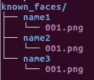

# Vending Machine UI
智能传感器与执行器实验室实训台UI界面。系统配置、使用教程等、查看[参考文档](./doc/Tutorial.md)。
## 用户接口
### 人脸识别
对比预设已知用户，实时侦测识别人脸。可通过UI直接注册新用户。可通过UI登录或注销用户状态。
#### 图像获取 `LiveCamera`
使用`OpenCV`调用USB摄像头，通过QThread传送图像至UI。
- 相机：默认使用`VideoCapture(0)`
- 相机调用分辨率：QVGA(320 x 240)
#### 人脸识别 `RecogFace`
人脸识别调用[face_recognition](https://github.com/ageitgey/face_recognition)进行侦测、识别
- 已知用户存储位置 `known_faces_path`:
`/data/known_faces`， 每个用户以用户名为文件夹，文件夹内存放用户照片\

- 人脸侦测模型`detection_model`：默认使用`hog`， 也可以使用`cnn`
- 侦测缩放比`scale_ratio`：默认`2`，使用缩小后的图像进行实时人脸侦测
- 识别阈值`recognition_thresh`：默认`0.6`，进行人脸特征值比对时的阈值
#### 用户注册
存储当前视频图像到已知用户存储目录
### ROS 接口
通过ROS接受实训台内传感器状态数据，发送控制指令
#### 发布的话题
- `drink_order(std_msgs/String)`\
饮料订单，`0`～`5`对应相应位置的饮料
#### 订阅的话题
- `drink_temp(std_msgs/Float32)`\
实训台内部温度，单位为摄氏度。 
- `drink_stats(std_msgs/String)`\
饮料库位状态，`1`为库位存在饮料，`0`为库位不存在饮料。字符串长度为6，分别对应6个饮料储存库位。
- `drink_ready(std_msgs/String)`\
饮料等待提取状态， `1`为可以提取，`0`为无饮料可供提取。
