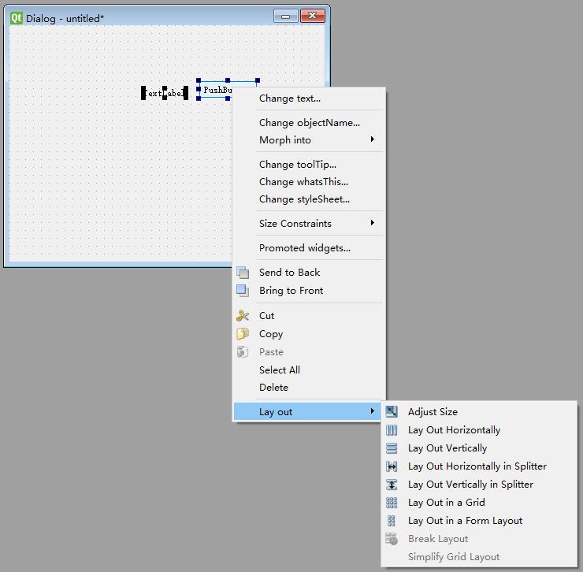

# UI implement tutorial

## 配置开发环境

系统版本为 Ubuntu 18.04

### Qt 环境配置

1. 安装PyQt：
由于ROS的Python版本为2.7，所以需要安装对应Python2的PyQt

    ```bash
    sudo apt install python-qt5
    ```

2. 安装QtDesigner, pyuic:

   - QtDesigner: 以图形化界面创建编辑ui文件
   - pyuic: 将ui文件转换为py文件

    ```bash
    sudo apt install qt5tools-dev-tools
    ```

### ROS 环境配置

1. 安装ROS：
按照[官方步骤](http://wiki.ros.org/melodic/Installation/Ubuntu)安装ROS Melodic
2. 配置系统环境：
加载系统环境变量设置

    ```bash
    source /opt/ros/melodic/setup.bash
    ```

3. 创建工作空间：
ROS包的编译与运行需要放在工作空间中，在合适位置创建ROS工作空间

    ```bash
    mkdir -p catkin_ws/src
    ```

4. 创建包：
由于UI是整体ROS包中的一部分，所以为UI创建ROS包，所有UI的编辑都在该包中完成

    ```bash
    catkin_create_pkg vending_ui rospy std_msgs std_srvs
    ```

### 人脸识别 环境配置

1. 安装`dlib`

    ```bash
    pip install dlib
    ```

2. 安装`face_recognition`

    ```bash
    pip install face_recognition
    ```

## 使用QtDesigner和PyQt搭建界面

使用QtDesigner设计编辑界面画面，使用PyQt编辑接口连接等内部功能

### QtDesigner

#### QtDesigner界面介绍


1. 应用窗口左侧提供了可以插入界面的部件，包括按钮部件、输入部件、容器部件等
2. 应用窗口中央是界面编辑区域
3. 应用窗口右侧为部件属性编辑区域，可以编辑所选部件的对象名，位置、大小、颜色、动作等。

#### 创建对话窗口 Dialog

对话窗口为UI界面的基础，在窗口内可以添加各类部件


#### 创建按钮 PushButton

按钮部件提供了基本的人机交互方法，可以实现的交互功能包括点击、按下、释放等。


1. 从部件选择侧边栏中选择`pushButton`,拖动至`Dialog`窗口中
2. 选择按钮，在右侧编辑按钮的属性

   - objectName：该部件在整个ui中唯一的名称，也是后续编程中调用该按钮的对象名
   - geometry：位置与大小可以在ui编辑界面中拖动改变，也可以在属性编辑栏手动输入
   - text：该按钮在ui中显示的文字
   - autoRepeat：该按钮再被按住是是否自动重复发出按压的信号

#### 创建显示 Label

`label`部件不仅可以用来显示文字，也可以用来显示图片。


1. 从左侧显示部件栏中选择`Label`拖动添加至`Dialog`界面中
2. 在右侧属性编辑栏中编辑部件的属性参数

   - objectName：该部件在整个ui中唯一的名称，也是后续编程中调用该按钮的对象名
   - geometry：位置与大小可以在ui编辑界面中拖动改变，也可以在属性编辑栏手动输入
   - frameShape：部件边框类型
   - text：该部件在界面上默认的显示文字
   - scaledContents：缩放内容，显示图片时自动缩放图片充满部件，对象名、位置、大小、显示默认显示文字、字体、文字位置、图片、缩放等。

#### 创建选项 CheckBox

`Check Box`部件用来表示勾选选项


1. 从左侧按钮部件选择栏中选择`Check Box`，拖动添加至界面中
2. 在右侧部件属性编辑栏中修改当前部件属性

    - objectName：部件对象名，后续编程中调用该部件的对象名
    - checkable：该部件是否可选
    - checked：该部件是否默认勾选

#### 创建数字显示 LCD

使用`lcdNumder`部件可以以类似LCD的形式显示数字与字符


1. 从左侧显示部件栏选择`LCD`拖动添加至`Dialog`界面中
2. 在右侧属性编辑栏中编辑部件的属性参数

   - objectName：该部件在整个ui中唯一的名称，也是后续编程中调用该按钮的对象名
   - palette：颜色显示方案，数字颜色使用`Light`,数字阴影颜色使用`Dark`
   - styleSheet：颜色选项，可以设定背景颜色`background-color`，边界颜色`border-color`等
   - digitCount：部件可显示数字最大位数
   - mode：显示数字类型，十进制或16进制等

#### 创建显示区域 GroupBox

使用`groupBox`来建立部件分组


1. 从左侧容器选择栏选择`Group Box`拖动添加至`Dialog`界面中
2. 拖动其他部件至该容器中
3. 在右侧属性编辑栏中编辑部件属性参数

   - objectName：该容器在整个ui中唯一的名称
   - title：该容器在界面上显示的标题内容
   - alignment：标题相对部件的对齐位置
   - checkable：该容器是否可选，对该容器内所有部件都生效
   - checked：该容器是否默认选择

#### 创建布局 Layout

布局可以固定多个部件之间的相互位置以及分布



1. 选择多个部件，从右键菜单中选择创建布局， 水平布局、垂直布局或网格布局等
2. 创建布局后，部件会自动调整之间的相互位置


#### 创建文字输入显示框 LineEdit

LineEdit部件可以用来获取输入文本，也可以用来显示文本


1. 从左侧输入部件选择选择`Line Edit`部件，拖动添加至`Dialog`界面中
2. 在右侧部件属性编辑栏中编辑部件属性

   - objectName:该部件在整个ui中唯一的名称，也是后续编程中调用该按钮的对象名
   - echoMode:文本显示模式，普通显示、密码显示
   - readOnly:该文本框是否为只读

### PyQt

#### 转换ui文件

通过`pyuic5`将由QtDesigner设计的**ui**文件转换为**Python**文件

```bash
pyuic5 ui_file.ui -o ui_file.py
```

#### 调用ui文件

导入转换好的ui文件，以及必要的Qt部件类

```python
from vending_demo_ui import *
from PyQt5.QtWidgets import QDialog, QApplication
```

创建Dialog界面类，实例化通过Designer编辑的ui

```python
class VendingUI(QDialog):
    def __init__(self):
        super(VendingUI, self).__init__()
        self.ui = UI_Dialog()
        self.ui.setupUi(self)
```

创建Qt程序，显示界面

```python
if __name__ == 'main':
    app = QApplication(sys.argv)
    v = VendingUI()
    v.show()
    sys.exit(app.exec_())
```

#### 插入图片

利用`label`部件显示图片。`label`部件不仅可以显示文字，也可以用来显示图片。显示图片需要将图片转换为`Pixmap`类。

1. 导入必要的模块

    ```python
    from PyQt5.QtGui import QPixmap
    ```

2. 利用`QPixmap`类读取并转换本地图片，然后更新到对应`label`部件中

    ```python
    ui.labelCoke.setPixmap(QPixmap('coke_picture.jpg'))
    ```

#### QInputDialog 弹出输入对话框

弹出输入对话框可以用来获取用户输入数据，例如按钮弹出窗口，获取输入数据


1. 创建弹出窗口，指定弹出窗口的输入类型，字符串、整数等

    ```python
    from PyQt5.QtWidgets import QInputDialog, QLineEdit
    # 创建字符串输入窗口，(对象，窗口标题，输入标题，输入显示模式）
    (text, ok) = QInputDialog.getText(self, 'Text Input', 'Type string', QLineEdit.Normal)
    ```

2. 该窗口可以作为按钮等动作的接收槽

    ```python
    ui.pushButton.clicked.connect(input_dialog)
    def input_dialog:
        (text, ok) = QInputDialog.getText(self, 'Text Input', 'Type string', QLineEdit.Normal)
        if ok:
            return text
    ```

#### Signal/Slot 信号与槽

利用信号与槽机制实现功能触发、传递变量等，参考[官方文档](https://www.riverbankcomputing.com/static/Docs/PyQt5/signals_slots.html)。

1. 创建信号, 创建的信号可以传递参数也可以不传递参数，传递的参数可以是Qt的数据类型也可以是Python的数据类型。

    ```python
    from PyQt5.QtCore import pyqtSignal
    # 创建信号
    DRINK_TEMP_SIGNAL = pyqtSignal(str)
    # 定义信号发送机制
    def update_temp():
        temp = '20.0'
        DRINK_TEMP_SIGNAL.emit(temp)
    ```

2. 创建槽，槽的构建需与信号类型一致。

    ```python
    from PyQt5.QtCore import pyqtSlot
    # 创建信号接收槽
    @pyqtSlot(str)
    def update_drink_temp(t):
        ui.lcdNumberTemp.display(t)
    ```

3. 连接信号与槽，同一信号可以连接多个槽。

    ```python
    DRINK_TEMP_SIGNAL.connect(update_drink_temp)
    ```

4. 大部分`ui`部件都提供一些和部件相关的信号，例如按钮部件的点击，选项部件的状态变，文字输入部件的按回车更等，连接该类信号与对应槽时，直接调用该部件信号的`connect`方法。

    ```python
    # 当点击按钮时，打印文本
    pushButton.clicked.connect(print_text)
    # 定义对应槽
    def print_text():
        print 'button clicked'
    ```

#### QSignalMapper 信号映射

QSignalMapper可以用来应对当有多个不含参数的信号连接同一个槽的情况，使用QSignalMapper可以设定对应信号在接收时的参数，例如字符串或整数。
QSignalMapper通过map接收信号，再通过mapped信号发送接收到的信号与参数，参考[官方文档](https://www.riverbankcomputing.com/static/Docs/PyQt5/api/qtcore/qsignalmapper.html)。

1. 导入所需包

    ```python
    from PyQt5.QtCore import QSignalMapper
    ```

2. 创建SignalMapper

    ```python
    mapper = QSignalMapper()
    ```

3. 连接信号到Mapper的槽，例如`pushButton.clicked`等

    ```python
    ui.pushButton1.clicked.connect(mapper.map)
    ui.pushButton2.clicked.connect(mapper.map)
    ui.pushButton3.clicked.connect(mapper.map)
    ```

4. 设定对应信号的参数，参数类型可以为`str`,`int`,`QObject`

    ```python
    mapper.setMapping(ui.pushButton1, '1')
    mapper.setMapping(ui.pushButton2, '2')
    mapper.setMapping(ui.pushButton3, '3')
    ```

5. 连接Mapper与槽，连接时需要根据标签的数据类型连接对应的槽

    ```python
    mapper.mapped[str].connect(display_slot)
    def display_slot(s):
        ui.label.setText(s)
    ```

#### QThread 多线程

利用Qt创建线程，以QThread为基础，只需要重新复写`run()`。

1. 创建新线程类，继承`Qthread`

    ```python
    from PyQt5.QtCore import QThread

    class LiveCamera(QThread):
        #复写运行功能
        def run(self):
            ...
    ```

2. 在UI类中，实例化进程类

    ```python
    # 导入创建的线程类
    import LiveCamera
    # 实例化子线程类
    video_thread = LiveCamera(self)
    # 启动线程
    video_thread.start()
    ```

#### 实时显示摄像头画面

利用线程与信号槽实现实时显示摄像头拍摄的画面

1. 创建线程类时，创建图像传输信号

    ```python
    class LiveCamera(QThread):
        # 创建图像传输信号
        img_signal = pyqtSignal(QImage)
        # 复写运行功能
        def run(self):
            ...
            self.img_signal.emit(qimg)
    ```

2. 在ui中实例化视觉线程

    ```python
    class ui(QDialog):
        video_thread = LiveCamera()
    ```

3. 连接线程信号与本地接收槽

    ```python
    video_thread.img_signal.connect(display_function)
    # 接收QImage信号，通过`label`在ui中显示图像
    @pyqtSlot(QImage)
    def display_function(self, qimg):
        self.ui.labelDisplay.setPixmap(QPixmap.fromImage(qimg))
    ```

4. 启动线程

    ```python
    video_thread.start()
    ```

#### closeEvent 关闭窗口

通过复写窗口关闭程序，可以自定义当点击窗口关闭按钮时执行的一系列动作

```python
def closeEvent(self, QCloseEvent):
    print('closing window')
    ...
```

### ROS

#### 显示ROS连接状态

利用`rosgraph`测试当前环境中是否有ROS Master

```python
import rosgraph
if rosgraph.is_master_online():
    print "Master is online"
else:
    print "Master is offline"
```

#### 显示订阅消息

利用Signal/Slot在界面上显示订阅的消息内容

1. 初始化ROS节点

    ```python
    import rospy
    rospy.init_node('ui')
    ```

2. 定义订阅器

    ```python
    from std_msgs.msg import Float32
    temp_sub = rospy.Subscriber('drink_temp', Float32, update_temp_cb)
    ```

3. 定义callback函数，可以在callback函数中直接定义显示更新，也可以利用Signal/Slot来传递变量

    ```python
    def update_temp_cb(self, msg):
        temp = round(msg.data, 2)
        # 通过信号传递数值
        DRINK_TEMP_SIGNAL.emit(str(temp))
        # 通过直接调用ui部件，完成状态显示更新
        self.ui.lcdNumber.display(str(temp))
    ```

#### 发布消息

利用Signal/Slot机制，通过部件动作发布ROS消息

1. 定义发布器

    ```python
    text_pub = rospy.Publisher('text_pub', String, queue_size=1)
    ```

2. 连接信号与消息发布

    ``` python
    # 以点击按钮为例，当点击按钮时发布消息
    pushButton.clicked.connect(publish_text)
    def publish_text():
        msg = String()
        text_pub.Publish(msg)
    ```

#### 通过按钮启动与结束ROS

ROS Master以及ROS node都可以通过界面上的动作手动控制启动与结束，只需要将相应的功能添加至ui中

1. 通过按钮启动ROS Master：由于ROS Master需要单独的进程，所以要利用Python的多进程

    ```python
    # 定义按钮信号连接
    pushButton.cliecked.connect(start_ros_master)
    # 定义ROS Master启动子进程程序
    import subprocess
    def start_ros_master():
        master = subprocess.Popen('roscore', stdin=subprocess.PIPE, stdout=subprocess.PIPE, stderr=subprocess.PIPE)
    ```

2. 通过按钮启动节点：如需要通过界面结束节点，则需要在启动时设置`disable_signals=True`，[rospy shutdown](http://wiki.ros.org/rospy/Overview/Initialization%20and%20Shutdown)

    ```python
    # 定义按钮信号连接
    pushButton.clicked.connect(start_ros_node)
    # 定义node启动程序
    def start_ros_node():
        rospy.init_node('ui', anonymous=True, disable_signals=True)
    ```

3. 当窗口关闭时，结束ROS：

    ```python
    # 当Dialog窗口关闭是执行
    def closeEvent(self, QCloseEvent):
        # 结束节点
        rospy.signal_shutdown('exiting app')
        # 结束ROS Master进程
        master.terminate()
    ```
